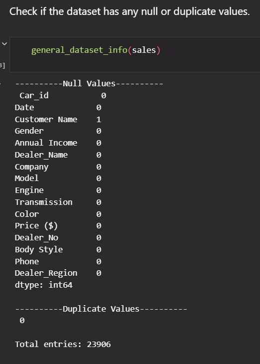
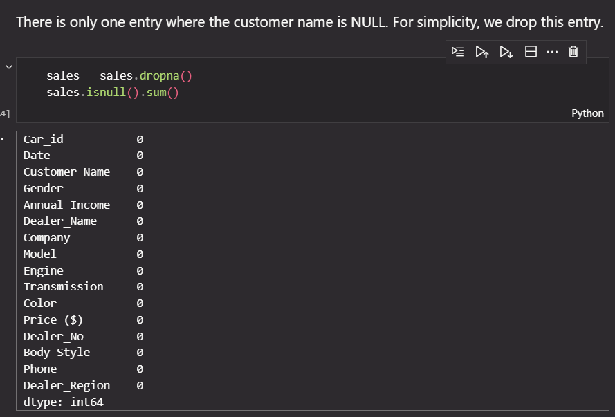
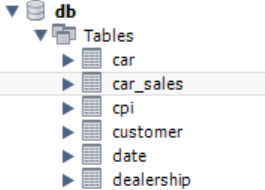
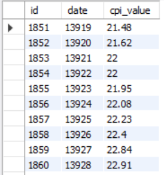
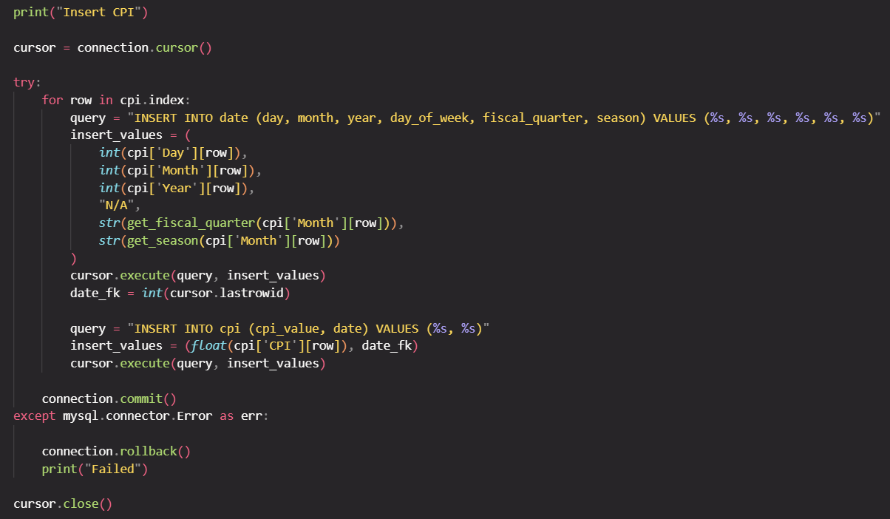
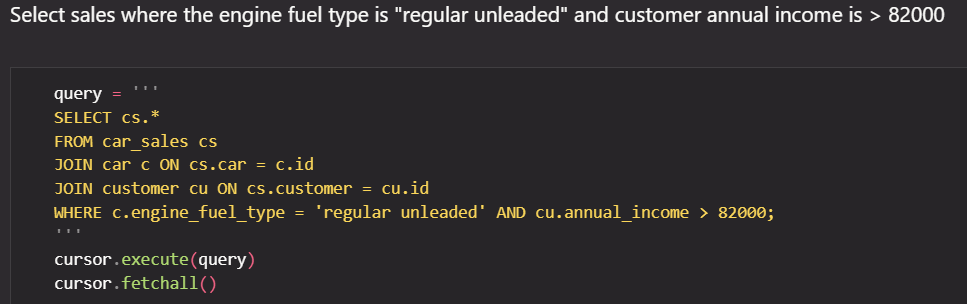
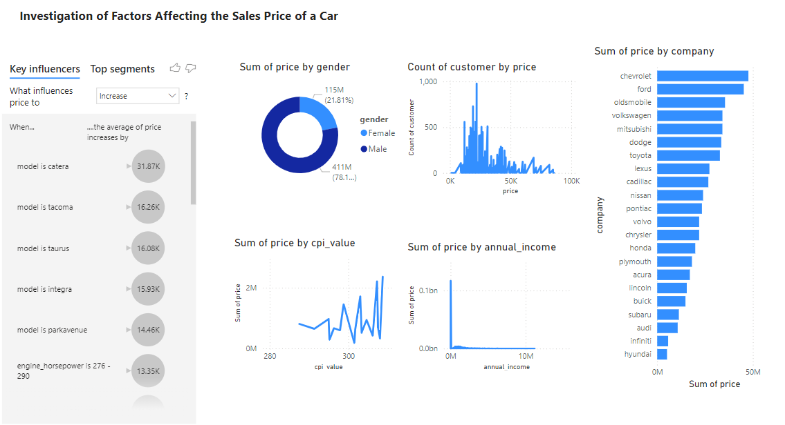
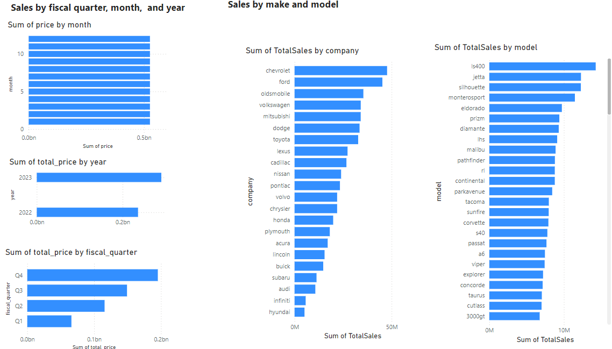
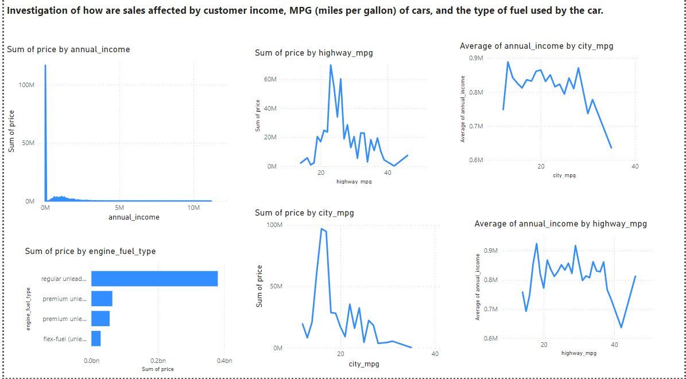

# Car Features and Sales OLAP

In this project, we created an OLAP (online analytical processing) system that organized the data of car sales and car features to analyze trends in car sales.

## Table of Contents

- [Overview](#overview)
- [Features](#features)
- [Technologies Used](#technologies-used)
- [Usage](#usage)
- [Screenshots](#screenshots)
- [Installation](#installation)
- [Contributing](#contributing)
- [License](#license)

## Objective

The objective of this assignment was to use data science techniques and analytical tools to create a data mart, relevant queries, an interactive dashboard of the data, and use artificial intelligence algorithms to preform data mining. This project served as a comprehensive data science project that provided hands on experience to apply the teachings of the course. For our project specifically, we were interested in exploring the patterns in car pricing with respect to to car features and the CPI (consumer price index). CPI was chosed as a metric to indicate the state of the economy at the time of purchase.

## Technologies Used

- jupyter notebooks
- mySQL
- Power BI

## Tasks

### Part 1 - Data Preprocessing

For this assignment, we used three datasets which required preprocessing to before being entered into the database. During preprocessing steps, we handled null values, duplicate enteries, corrected errors in enteries, and reformatted data. These preprocessing steps can be viewed in the file _CSI 4124 Part2ipnb_. Below is an example of how we identified null and duplicate values and addressed a null value in this particular dataset.

### Part 2 - Database

We created a mySQL database and enetered the data from the jupyter notebook. Below are some screenshots of the database and the process of inserting the data into the database.

_Screenshot of the database schema_

_Screenshot of some eneteries in the CPI table_

_Screenshot of jupyter notebook code used to enter CPI data into the database_

### Part 3 - Queries and Interactive Dashboard

In this phase of the assignment, we were instructed to created roll up, drill down, slice, dice, iceberg, and window queries that were relevant to our dataset. These queries were then combined into combination queries, such as a slice and dice query. Below is a screenshot of a dice query that selects car sales enteries in the database where the car engine fuel type is "regular unleaded" and the customer income is >82000.

_Screenshot of dice query that selects car sales enteries in the database where the car engine fuel type is "regular unleaded" and the customer income is >82000_

For the interactive dashboard, we used Power BI. The dashboard can be viewed by opeing the _BI_Dashboard.pbit_ file. Screenshots of the dashboard are below.

_Screenshots of the dahsboard_

### Part 4 - Data Mining

In this phase of the project, we were intructed to use three AI models to classify our data in a meaningful way. We implemented a decision tree model, gradient boosting model, and gradient boosting model to classify the prices of cars based on their features as this sort of classification could be useful to dealership, for example, when pricing their vehicles. We compared the precision, recall, and runtimes of the models. The data mining process can be viewed in the _Data Mining.ipynb_ file.
